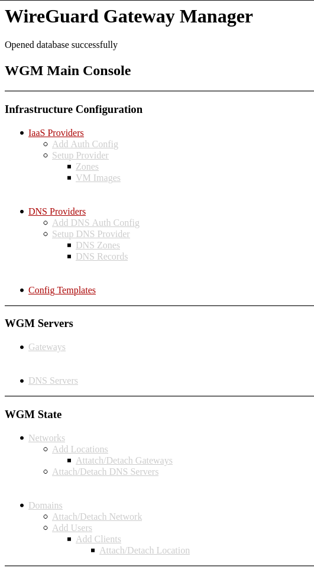
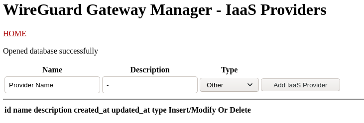
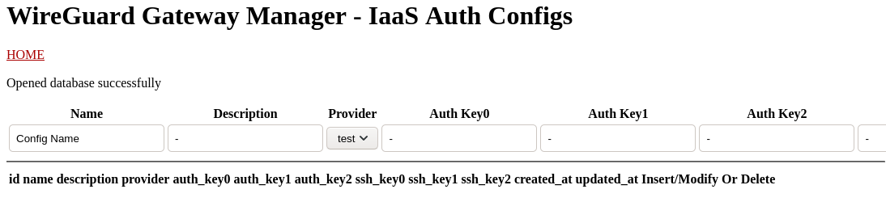
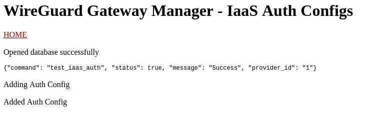
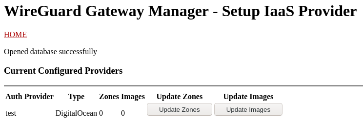
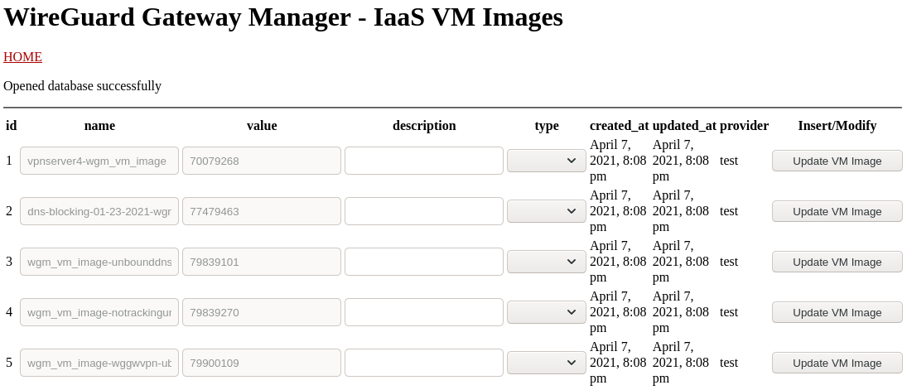

# WireGuard-Gateway-Manager
- [About](#About)
- [Dependencies](#Dependencies)
- [Install](#Install)
  - [Get WireGuard Gateway Manager](#Get-WireGuard-Gateway-Manager)
  - [Setup Database](#Setup-Database)
  - [Configure WireGuard Gateway Manager](#configure-wireguard-gateway-manager)
  - [Configure The API](#configure-the-api)
  - [Configure The CLI](#configure-the-cli)
- [Using WireGuard Gateway Manager](#using-wireguard-gateway-amnger)
  - [Open WireGuard Gateway Manager for the first time](#Open-WireGuard-Gateway-Manager-for-the-first-time)
  - [Setup IaaS Provider](#Setup-iaas-provider)
  - [Setup DNS Provider](#setup-dns-provider)
  - [Check Config Templates](#check-config-templates)
  - [Deploy Gateway Servers](#deploy-gateway-servers)
  - [Deploy Dns Servers](#deploy-dns-servers)
  - [Create a Network](#Create-a-network)
  - [Create Network Locations](#create-network-locations)
  - [Attach Gateway Servers to Network Locations](#attach-gateway-servers-to-network-locations)
  - [Attach DNS Servers to Network](#attach-dns-servers-to-network)
  - [Create Your First Domain and User](#create-your-first-domain-and-user)
  - [Create a Client](#create-a-client)
  - [Attach Client to Location](#attach-client-to-location)
  - [Setup PrivacyBot](#setup-privacybot)

## About
WireGuard Gateway Manager is a web app for deploying and managing WireGuard Gateway's and Clients


## Dependencies

- WireGuard
- Webserver
- PHP
- Python 3

## Install

*In order for WireGuard Gateway Manager to interact with the gateway servers, the webserver must run as a user with a `/home/` directory and a pair of SSH keys setup in `~/.ssh/`.*

### Get WireGuard Gateway Manager
First extract the tarball to a working webdirectory. 

`tar -xvf [WGM_RELEASE].tar.bz2`

*OR* clone this repo.

`git clone https://github.com/Skylaski-VPN/WireGuard-Gateway-Manager`

### Setup Database
WireGuard Gateway Manager uses PostgreSQL to maintain it's state. You can read [this guide](https://medium.com/coding-blocks/creating-user-database-and-adding-access-on-postgresql-8bfcd2f4a91e) on getting started with PostgreSQL.

Once you have a user and database ready to go, use the provided `pg_dump` file to setup the database.

`psql --dbname=[DATABASE_NAME] < wgm_db.sql`

### Configure WireGuard Gateway Manager
Once the database is ready to go open `wgm/wgm_config.sample.php` and edit your database settings.

```
<?php
        // Configuration for connecting to PostgreSQL Database
        $db_host        = "host = <DB HOST>";
        $db_port        = "port = <DB PORT>";
        $db_name      = "dbname = <DB>";
        $db_credentials = "user = <DB USER> password=<DB PASSWORD>"
?>
```

Once finished save as `wgm/wgm_config.php`.

### Configure the API
To configure the API open api/<version>/config.sample.php and edit the necessary variables. The path to the CLI must be the full path starting from root `/`.

```
<?php
        // Configuration for connecting to PostgreSQL Database
        $db_host        = "host = <DB HOST>";
        $db_port        = "port = <DB PORT>";
        $db_name      = "dbname = <DB>";
        $db_credentials = "user = <DB USER> password=<DB PASSWORD>";

        $PATH_TO_CLI = "<FULL PATH TO wgm/cli/>";
?>
```

### Configure the CLI

The configuration example for the CLI is stored in `wgm/cli/wgm_db/` as `config.sample.ini`. Open that file, edit, and save as `config.ini`.

```
[postgresql]
host=<DB HOST>
database=<DB NAME>
user=<DB USER>
password=<DB PASSWORD>
```

## Using WireGuard Gateway Manager

### Open WireGuard Gateway Manager for the first time
Browse over to your webapp making sure to point your browser to the `wgm` directory; example: `https://www.example.com/wgm/`.



### Setup IaaS Provider
Once here, the first thing you need to do is setup your IaaS provider, add an auth config for authenticating with your providers API and download the list of available zones and virtual machine images.

Currently WireGuard Gateway Manager only supports DigitalOcean. Please see [this document](docs/iaas/digitalocean/README.md) on getting DigitalOcean setup for WireGuard Gateway Manager.

Once DigitalOcean is ready to go create the IaaS provider in WireGuard Gateway Manager by clicking the 'IaaS Providers' link.


Here you'll set a Name and Description as well as Type. Make sure you select DigitalOcean as the provider type. 'Other' is not supported.

Once created we can move on to setting up the authentication configuration.

Click 'HOME' or navigate back to `/wgm/` in your web browser and you'll see the 'Add Auth Config' link is now active. 

Click 'Add Auth Config' to setup authentication for this provider's API.



Here you *MUST* fill out a Name and Description as well as 'Auth Key0' which is your DigitalOcean API token created earlier. 

'SSH Key0' *MUST* also be provided. Make sure this is a Public SSH Key that has been setup in your DigitalOcean environment as well. 

When you go to add an Auth Config, WireGuard Gateway Manager will test your tokens and keys to make sure their valid. 



Once a proper Auth Config has been setup, we need to download the available Zones and Images for this IaaS Provider. 

Navigate back to 'HOME' and you'll see the 'Setup Provider' link is enabled.



Click 'Update Zones' to download a list of available zones for this provider.

Click 'Update Images' to download a list of available images for this provider. 

Click 'HOME' to go back to the main page. 

Now you'll notice the Zones and VM Images links are both available. You can confirm the list of Zones by clicking that link, but let's jump over to our VM Images.



Here is where we will identify which images are DNS servers and which ones are WireGuard Gateway Servers.

You'll need to update the type and description for at least 1 of each (Gateway & DNS) to continue. 

Once you've done that, your IaaS Provider is ready to rock and roll. 

### Setup DNS Provider

WireGuard Gateway Manager uses a DNS Provider to deploy domain names for your Gateway servers. This has nothing to do with your DNS Servers or Images, only allowing WireGuard Gateway Manager to setup DNS for your Gateway Servers when you deploy them. 

WireGuard Gateway Manager currently only supports Cloudflare for DNS services. See [this document](docs/dns/cloudflare/README.md) on getting Cloudflare setup for use with WireGuard Gateway Manager.

Once you're ready to go click the 'DNS Providers' link to create a DNS Provider. Give it a relevant name and description before moving on to the Auth Config.

When setting up your Auth Config 'Auth Key0' is mandatory and will be validated before the config is created. This should be an API token with proper permissions from Cloudflare setup previously. 

### Check Config Templates

WireGuard provides Config templates out of the box for Clients and Gateways. You shouldn't have to mess with these at all, but if you want to setup a specific MTU or Keepalive value, this is where you would do that. 

### Deploy Gateway Servers

Deploying a gateway server with WireGuard Gateway Manager is pretty easy. Once your IaaS Provider is setup you should be able to access this link and set the appropriate options. 

Adding a GW server will deploy a VM on the IaaS provider's environment using a provided image within the specified zone. 

### Deploy DNS Servers

Same as above

### Create a Network
A Network in WireGuard Gateway Manager is a logical network identified by it's private IPv4 and IPv6 addresses. A network is a collection of DNS Servers, Locations and Gateway servers assigned to those Locations.

To create a functioning Network you must have at least 1 Gateway server and DNS server deployed. 

### Create Network Locations
Each Network can have it's own set of Locations. These Locations only exist logically in WireGuard Gateway Manager, but are used to load balance clients across all Gateway servers associated with them.

### Attach Gateway Servers to Network Locations

Before a client can connect to a network, a Gateway Server must attached to a location in a Network. This sets the server up with the appropriate IP Addresses and enables NAT Forwarding in order to act as a gateway to the internet for the client. 

### Attach DNS Servers to Network

In order for clients to perform DNS resolution on any Network, the Network must have DNS Servers attached to it. 

### Create Your First Domain and User

Before you can create a client you first need a user, but even before that you need a domain for the user to reside in. 

Domains are how WireGuard Gateway Manager organizes users. In a typical B2C setup each user belongs to their own Domain, but these could be used to offer 'Family' plans where the primary user's family all belong to the same Domain. 

Ultimately Domains serve the B2B model where small teams and businesses all belong to a single domain and services are provided to a number of their users.

### Create a Client

Once a Domain is setup and has a single User we can create a client. When creating a client we upload it's Public WireGuard Key, the DNS type it prefers. The WireGuard Public Key is mandatory as it's used to peer the client to the WireGuard Gateway.

### Attach Client to Location

When attaching a client to a given location, an ipv4 and ipv6 lease is generated, the peer is created on the server at that location with the lowest number of active leases and the client's record is updated with relevant data needed to generate a WireGuard configuration. 

### Setup PrivacyBot

PrivacyBot is a simple script that interprets the output of the `wg` command and re-peers any peer that hasn't sent a Keepalive packet in more than 3 minutes.

PrivacyBot runs via the `checkpeers.py` script in wgm/cli/. To setup PrivacyBot open that script and set `NETWORKS` and `wg_output_path` to appropriate values and save.

```
# CHANGE THESE FOR YOUR SETUP AND UNCOMMENT
#NETWORKS = [ 1 ]
#wg_output_path = '/full/path/to/wgm/cli/privacybot/wg_output.out'
```
Once these are setup you can run checkpeers.py on a regular basis via a cronjob. 


