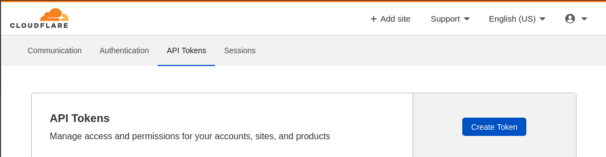
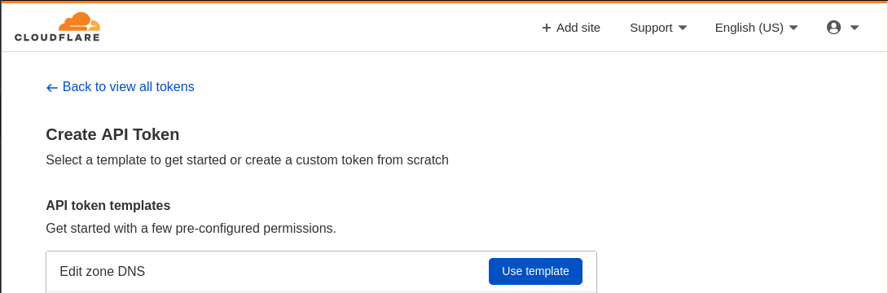
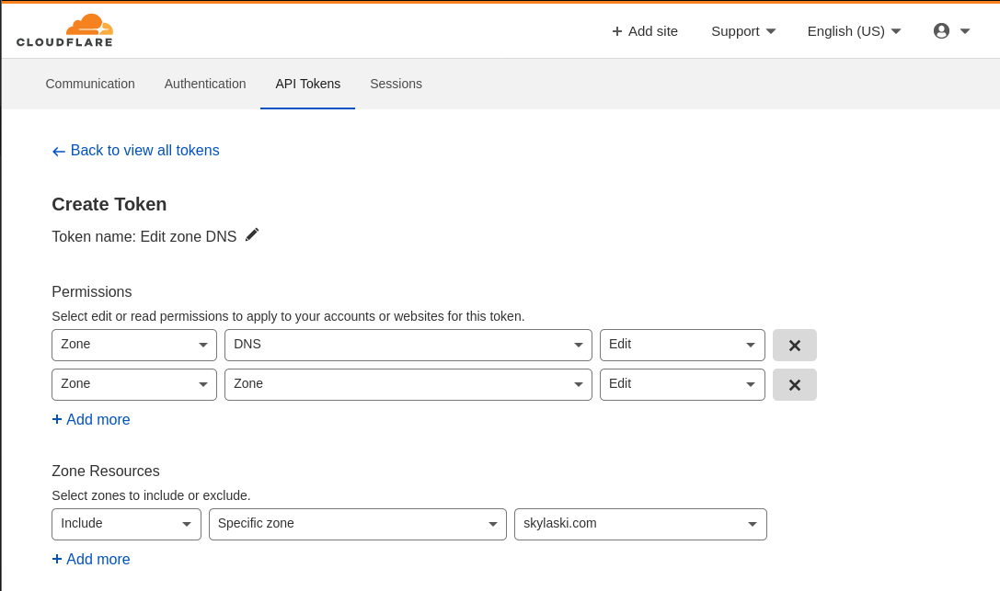

# Cloudflare DNS Services for WireGuard Gateway Manger
WireGuard Gateway Manager supports using Cloudflare to automatically create DNS entries for your Gateway servers at deployment.

In order to do this however, Cloudflare needs to be setup with the following.

1. At least 1 DNS Zone.
2. An API Token with Zone.Zone, and Zone.DNS permissions.

You typically setup at least 1 Zone when creating your Cloudflare account so we'll skip that bit, but to create your API token, browse over to your API Tokens page typically accessible via your [dashboard](https://dash.cloudflare.com/profile/api-tokens).

When creating your API Token you can typically begin with the Edit zone DNS template.

After you select that template you can add additional permissions. 

Also, make sure you allow the token access to the Zone Resource you want to add DNS records to.

When finished click 'Continue to Summary' and then 'Create Token'.

Here you'll be presented with your token. Save this to a secure location as it will not be shown again. 

----

Now you're all setup to use Cloudflare as your DNS Provider for WireGuard Gateway Manager

