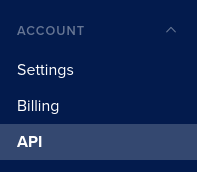
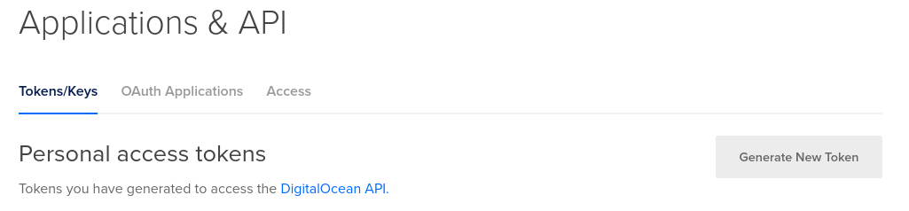
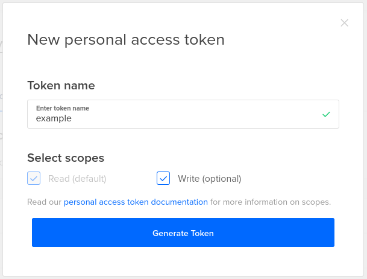
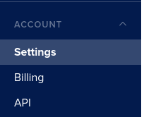
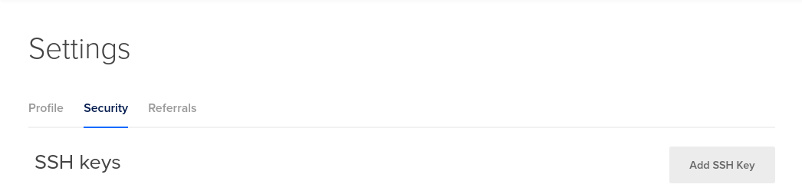
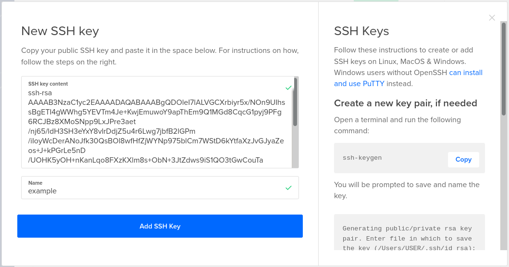

# Setting Up DigitalOcean for WireGuard Gateway Manager

WireGuard Gateway Manager supports deploying WireGuard gateways and DNS servers to DigitalOcean.

In order for this to work, WireGuard Gateway Manager needs 4 things already setup in DigitalOcean.
1. DigitalOcean API Key with Read/Write access.
2. SSH Keys provisioned in DigitalOcean and accessible.
3. At least 1 Gateway VM Image aptly named so WireGuard Gateway Manager can see it.
4. At least 1 DNS VM Image aptly named so WireGuard Gateway Manager can see it.

This document will walk you through the steps of getting all 4 setup. 

## DigitalOcean API Key

Once logged into DigitalOcean and looking at your dashboard, navigate to the API settings via the link at the bottom of the lefthand navigation bar. 



From here you will need to Generate New Token.



Make sure you give it an appropriate name as well ad Read *and* Write access.



Once generated you will need to save your access token somewhere safe. It will only be shown to you once. 

This access token is used in setting up your IaaS provider in WireGuard Gateway Manager under `Setup IaaS Provider`.

However, it's not the only bit of information needed. We'll also need an SSH key for deploying and accessing our servers.

## SSH Keys in DigitalOcean

WireGuard gateway manager will control your Gateway Servers via SSH. 

In order for this to work, the user your webserver is running as must be able to execute shell commands as a user with a home directory and `.ssh/` directory with a valid ssh private and public key.

When setting up WireGuard gateway manager you should have configured your webserver to run as this user and generated an SSH keypair available to you in `/home/[user]/.ssh/`.

The public key will be called something like `id_rsa.pub`.

We'll import this public key into DigitalOcean now.

First browse to your account page on DigitalOcean via the link at the bottom of the left-hand navigation menu.



From here select the Security tab at the top where you can add your SSH key.



Make sure you provide an appropriate name and copy paste your key into the appropriate box.



This key will also be used in setting up your IaaS provider in WireGuard Gateway Manager. Provisioning it in DigitalOcean allows us to deploy servers with this key as well. 


## WireGuard Gateway VM Image

WireGuard Gateway Manager deploys servers using available images in DigitalOcean. In order for WireGuard Gateway Manager to find the appropriate image they must be named starting with `wgm_vm_image`. This way whether the image is a Custom Image or a Snapshot of an existing Droplet, WireGuard Gateway Manager will be able to find it. 

To get an image ready for WireGuard Gateway Manager, in this example, we deploy an Ubuntu Droptlet, set it up for becoming a WireGuard Gateway, then shut it down and take a snapshot. We prefix the snapshot name with `wgm_vm_image` so WireGuard Gateway Manager can find it later.

This guide won't go into detail on how to deploy a Droplet in DigitalOcean manually, but for a WireGuard Gateway Server we highly recommend you make the following changes before creating a snapshot image.

### Update the VM
```
sudo apt update
sudo apt upgrade
```

### Ensure IP Forwarding is enabled.
```
sudo echo "net.ipv4.ip_forward = 1" > /etc/sysctl.d/wg.conf
sudo echo "net.ipv6.conf.all.forwarding = 1" >> /etc/sysctl.d/wg.conf
```

### Install WireGuard
`sudo apt install wireguard`

*Be sure to make your images available in all zones you plan to deploy to!*

## DNS Server VM Image

Setting up a fully functional DNS server is beyond the scope of this document, but it's not too difficult.

Skylaski VPN uses [unbound](https://nlnetlabs.nl/projects/unbound/about/).

Once you have a working DNS server image, just like above, make sure the name is prefixed with `wgm_vm_image`.

----

Once all 4 things are setup in your DigitalOcean environment you should be good to go with using it as an IaaS provider in WireGuard Gateway Manager.
